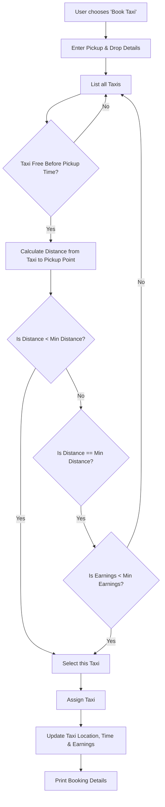
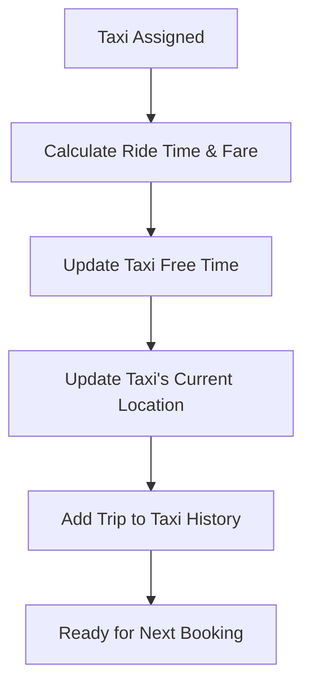

[README.md](https://github.com/user-attachments/files/23963946/README.md)
# 🚖 Taxi Booking System

A simple **Java console-based Taxi Booking System** designed using **Object-Oriented Programming**, **Lists**, and **custom business logic**.
The system automatically assigns the most suitable taxi based on **distance**, **availability**, and **lowest earnings**.

---

## ⭐ Features

* Book a taxi based on pickup and drop locations
* Automatically select the **nearest available taxi**
* If two taxis are at the same distance → assign taxi with **lowest earnings**
* Each taxi tracks:

  * Current location
  * Free time (next available time)
  * Total earnings
  * Trip history
* Clean and structured output for each booking
* Input validation & safe booking logic

---

## 📁 Project Structure

```
TaxiBooking/
 ├── src/
 │    └── taxi/
 │          ├── MainClass.java
 │          ├── Taxi.java
 │          ├── TaxiBookingService.java
 │          └── module-info.java
 ├── .classpath
 ├── .project
 ├── README.md
```

---

## 📊 Flowchart – Taxi Allocation Logic



---

## 🔄 Flowchart – Trip Completion



---

## 🧪 How to Run

1. Open project in **Eclipse**
2. Right-click `MainClass.java` → **Run As → Java Application**
3. Enter Pickup and Drop points (A–F mapped as 1–6)
4. System automatically allocates the best taxi

---

## 📌 Sample Output (Formatted)

```
Taxi 2 is allocated
---------------------------------------------------
Customer ID : 101
Taxi ID     : 2
Pickup      : B (2)
Drop        : E (5)
Start Time  : 9
End Time    : 12
Trip Charge : Rs. 450
---------------------------------------------------
```

Taxi List after booking:

```
Taxi 1 → Location: A | Free At: 0 | Earnings: 0
Taxi 2 → Location: E | Free At: 12 | Earnings: 450
Taxi 3 → Location: A | Free At: 0 | Earnings: 0
Taxi 4 → Location: A | Free At: 0 | Earnings: 0
```

---

## 📘 Technologies Used

* **Java SE 21**
* **Eclipse IDE**
* **Collections Framework (List)**
* **OOP Principles (Encapsulation, Classes, Methods)**

---

## 🤝 Contributing

Feel free to **fork**, improve, and make pull requests!

---

## 📄 License

This project is open-source and free to use.

---
